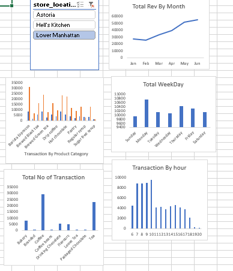

# COFFEE-SHOP ANALYSIS

## Introduction/Project Overview 
This Data Analysis project aims to provide insight of three coffee and tea shops located in New York City, specifically in Lower Manhattan, Hell's Kitchen and Astoria. From this dataset analysis, we are to understand sales patterns and customer behavior, to analyze the performance of different products, to identify peak sales hours and days, to identify trend in customer’s Purchases, and to evaluate the revenue generated by various categories of products.
## Data Source:
Coffee Shop Sales Raw File.xlsx. The primary  Dataset of this Project contained detailed transaction information of three coffee shops including Transaction IDs, Dates,Times, Quantities, Store Ids, Location, Product IDS, Product Type, Product Details,Unit Price, Product Category. The Data covers transactions from three shops from January to June 2023. the dataset is an Excel File by the company.
## Data Description
The dataset is made up of detailed records from three coffee shops over a period of time. The data has the following columns:•	Transaction_id: Unique identifier for each transaction,•	transaction_date: Date when the transaction took place•	transaction_time: The exact Time of transaction, •	transaction_qty: Quantity of items purchased in the transaction,•	store_id: Identifier for the store where the transaction took place.	store_location: Location of the store.•	product_id: Unique identifier for the product.  •	unit_price: Price per unit of the product.•	product_category: Category of the product (e.g., Coffee, Tea, Bakery, Drinking Chocolate).•	product_type: Type of product (e.g., Gourmet brewed coffee, Brewed Chai tea). 	product_detail: Detailed description of the product.•	Revenue: Total revenue generated from the transaction. •	Month: Month  the transaction occured.

## Problem Statement
- Total Sales by Product Category: Summarizing total sales for each product category.
- Total revenue generated by each store: This shows the total revenue generated by each store.
- Sales Trend by Hour:	Identify peak sales hours and determine the most popular times of day for transactions.
- Total Revenue by Store Location: Compare the overall sales performance among the three store locations.
- Total Revenue by Quantity: Identify the most popular products based on the quantity sold and revenue generated.
- Purchasing Trend in a given Period: Identify patterns in customer purchasing behavior, such as the frequency of purchases for specific product categories and types.
- Sales Trend within the day : Analyze the distribution of transactions throughout the day.
- Revenue Trend by hour: Compare the hourly revenue trends among the three stores.
  ## Skills/Concepts Demostrated
  ### Data Cleaning and preparation
  -  Data collection, sorting snd filtering.
  -  Remove Duplicate
  -  Text Functions
	-  Date and Time Functions
  -  Data Validation and Analysis
  -  Pivot Tables
  -  Pivot Charts:
	-  Formulas function
	-  Charts and Graphs
  -  Slicers 
  -  Advanced Analysis Reporting and Dashboarding
  -  Dashboard Creation
  ## Data Cleaning/ Transformation
   In the beginning of Data Preparation Phase, the following tasks were performed.
  
  1.  A column for Revenue was added using operator =D2*H2.
  2.  A column for month was added using =TEXT(B2,"mm")
  3.  A column for monthName was added =TEXT(B2,"mmm")
  4.  A column for weekday was added using =WEEKDAY(B2,2)
  5.  A column for WeekDay Name was added using =TEXT(B2,"DDDD")
  6.  A column for Hour using =HOUR(C2)
  ## Analysis and Summaries With Pivot Tables
  
  
1. Rows: Month
- Values: Sum of unit price * transaction qty
- This analysis showed the total Revenue revenue generated in each Month.
2.Total Transaction per Day of Week
- Rows: WeekdayName
- Values: Count of Transaction id
- This analysis showed the count of transactions each week day.
3. Total Transaction by hour of Day
- Rows: Hour
- Values: Count of Transaction id
- This analysis showed the count of transactions each week day.
4. Total Transaction per product category
- Rows: product_category
- Values: Count of Transaction_id
- This analysis  showed the count of transactions per product_category .
5. Number of transactions and revenue by product_type and filtered to the top 15(by transaction)
- Rows: product_type
- Values: Count of Transaction_id, Sum of Revenue
- This analysis showed the count of transactions and Sum of Revenue per product type by transaction.
  
  
  
  

  

